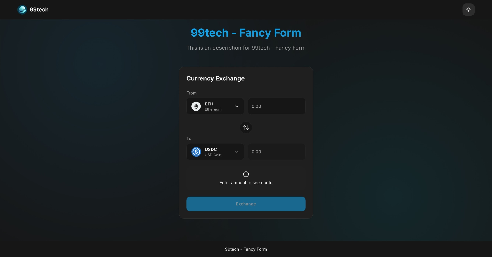
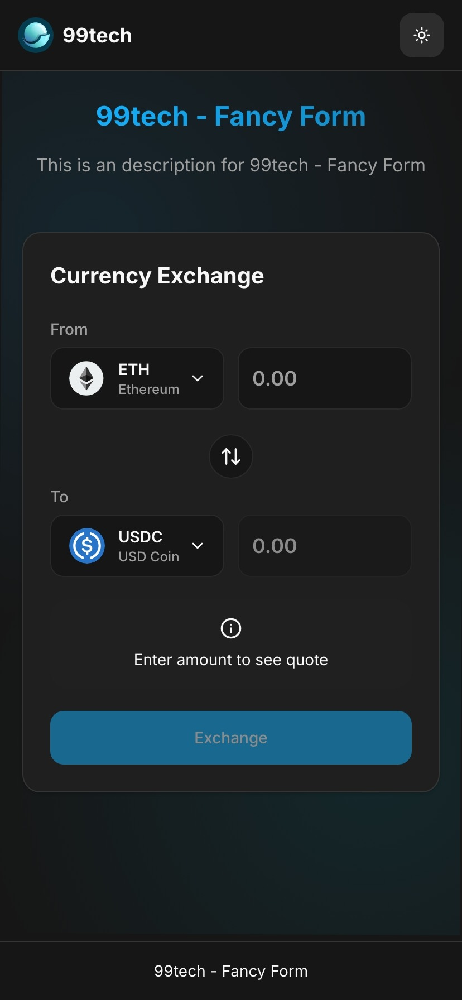
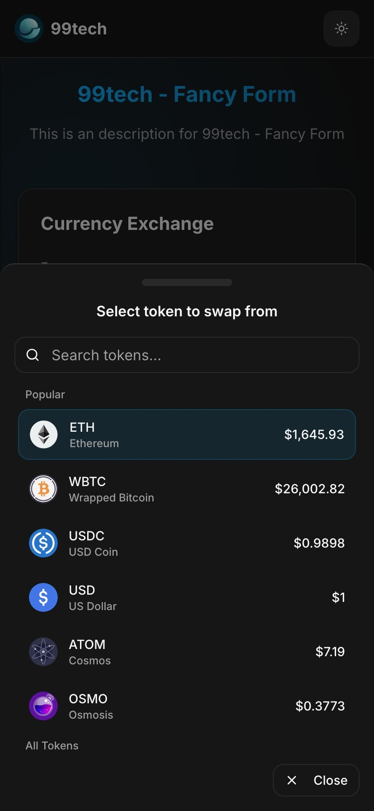

# Problem 2: Currency Swap Application

## Overview
A React TypeScript application for cryptocurrency swapping with real-time price quotes, form validation, and internationalization support.

## Screenshots

### Desktop View


### Mobile Views



## Features

### Core Functionality
- Currency swap between different cryptocurrencies
- Real-time price quotes and exchange rates
- Form validation with Zod schema
- Mock transaction execution with hash display

### User Experience
- Responsive design with Tailwind CSS
- Dark/light theme support
- Internationalization (i18n) with multiple languages
- Loading states and error handling
- Animated UI components with Framer Motion

### Technical Stack
- React 19 with TypeScript
- Vite for build tooling
- React Hook Form with Zod validation
- Zustand for state management
- TanStack Query for API calls
- Tailwind CSS for styling
- Radix UI components

## Development

```bash
# Install dependencies
pnpm install

# Start development server
pnpm run dev

# Build for production
pnpm run build

# Run linting
pnpm run lint

# Format code
pnpm run format
```

